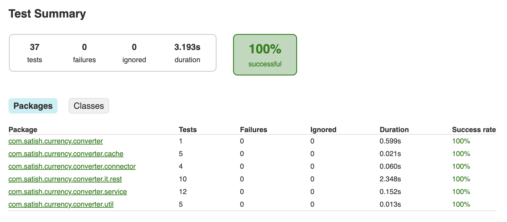
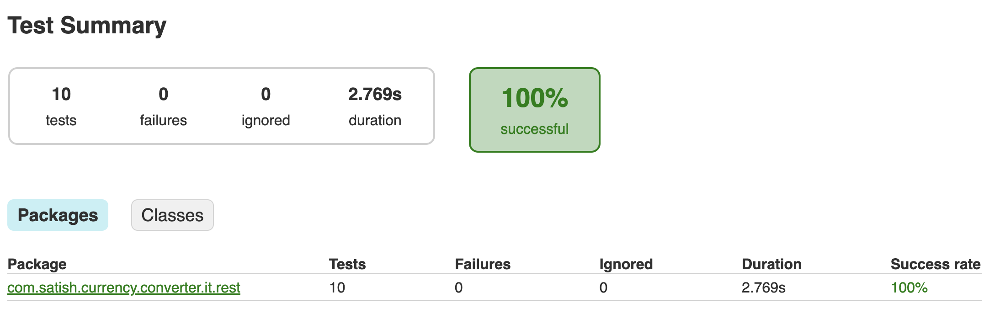
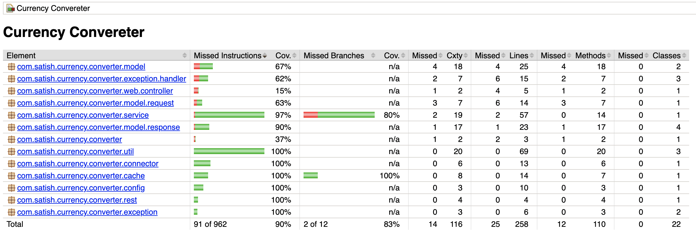

# 3 REST APIs along with unit, integration tests and Code Coverage Report

### Get Symbols API
```
- GET http://localhost:8080/api/v1/symbols
- Sample response
     - {
	    "code": "S0000",
	    "message": "Success",
	    "symbols": {
	        "AED": "United Arab Emirates Dirham",
	        "AFN": "Afghan Afghani",
	        "ALL": "Albanian Lek"
	     }
	   }
```
### Convert API
```
- POST http://localhost:8080/api/v1/convert
- Request Headers:
     - content-type : “application/json”
- Request POST Body
     - { "sourceBase": "EUR", "targetBase" : "ZMW", "sourceBaseValue" : "3" }
- Sample response 
     - {
	    "code": "S0000",
	    "message": "Success",
	    "targetBaseValue": 77.641632
	   }
```
### Get Exchange Rates API
``` 
- GET http://localhost:8080/api/v1/exchangeRates?base=GBP 
- Sample response 
     - {
	    "code": "S0000",
	    "message": "Success",
	    "base": "EUR",
	    "rates": {
			        "AED": 4.002496,
			        "AFN": 75.807825,
			        "ALL": 101.476647,
			        "AMD": 439.093765,
			        "ANG": 1.965947,
			        "AOA": 906.300543,
			        "ARS": 393.023058,
			        "AUD": 1.643684,
			        "AWG": 1.961928
		         }
	    }
	    
  (Note: Since I am using free acccount , I can not pass 'base' query param to http://api.exchangeratesapi.io/)
 

```


### Tech Stack
``` 
Java 17
Spring Boot 2.7.3
Spring WebFlux Reactor 
Junit
Mockito
Reactor test
Gradle
```

### To build project
``` 
./gradlew build
```

### To start server
``` 
./gradlew bootRun

or 

java -jar {find the jar inside build/libs folder}
```

### To run integration tests
``` 
./gradlew integrationTest --info
```

### To generate test coverage
``` 
./gradlew test
./gradlew jacocoTestReport
```


### To run specific test class
``` 
./gradlew test --tests com.satish.currency.converter.service.ExchangeRateServiceTest
```

### Unit Test , Integration Test and Code Coverage reports location
``` 
Unit Test Report : $PROJECT_HOME/build/reports/tests/test/index.html
Integration Test Report : $PROJECT_HOME/build/reports/tests/integrationTest/index.html
Code Coverage Report : $PROJECT_HOME/build/reports/jacoco/test/html/index.html
```


## Unit Test Report
 


## Integration Test Report
 


## Code Coverage  Report
 


### Some notes
``` 
1. Entry point RestService class
2. Object Oriented + functional + Reactive implementation 
3. ExchangeRateService class has documentation for all 3 API's logic
4. Added input validations of post body and query param using validator annotations
5. Integration tests - RestServiceIT
6. Cache is implemented , available at ExchangeRateCache class
7. Success response of Currency Converter API's will have code as "S0000"
8. Failure response of Currency Converter API's will have code as "EXXXX"
9. Any exception in any flow will be handled by exception handlers in "com.satish.currency.converter.exception.handler" package 
10. Set "EXCHANGE_RATE_ACCESS_KEY" environment variable for making exchange rates API(https://exchangeratesapi.io/) calls to work.

